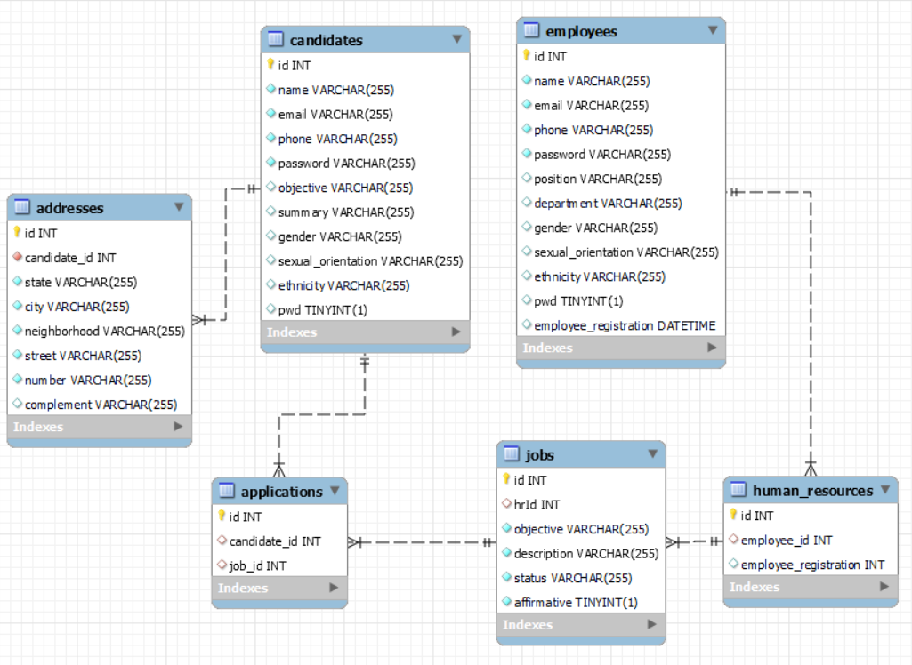

# Ada Hack - Corp Solutions

## Descrição do Problema

A Corps Solutions está comprometida em aumentar a inclusão e diversidade em seu quadro de colaboradores, reconhecendo que a diversidade é fundamental para a inovação e o sucesso organizacional. No entanto, atualmente enfrentamos desafios na identificação e promoção de inclusão e diversidade em nossa empresa. Tanto os colaboradores existentes quanto os futuros candidatos devem refletir uma ampla gama de origens, perspectivas e experiências.

O principal desafio enfrentado pelo setor de RH é a falta de ferramentas e sistemas para avaliar e monitorar efetivamente a diversidade em nossa empresa. Atualmente, não temos uma maneira sistemática de acompanhar métricas de diversidade, como representação de gênero, etnia, idade, habilidades e outras características importantes.

Como resultado, nossa capacidade de identificar lacunas na diversidade, implementar iniciativas de inclusão e avaliar seu impacto é limitada. Isso pode levar a uma cultura organizacional estagnada e a oportunidades perdidas para atrair e reter talentos diversos.

**Conteúdo**

- [Objetivo do Projeto](#objetivo-do-projeto)
- [Sobre a Aplicação](#sobre-a-aplicação)
- [Requisitos](#requisitos)
    - [Funcionais](#funcionais)
    - [Não Funcionais](#não-funcionais)
- [Funcionalidades](#funcionalidades)
    - [1.Cadastro e Login de Usuários](#1-cadastro-e-login-de-usuários)
        - [Fluxo de Cadastro](#fluxo-de-cadastro)
        - [Fluxo de Login](#fluxo-de-login)
        - [Divisão de Perfis de Usuários](#divisão-de-perfis-de-usuários)
    - [2.Análise de dados demográficos dos colaboradores e candidatos](#2-análise-de-dados-demográficos-dos-colaboradores-e-candidatos)
        - [Processo de Análise](#processo-de-análise)
        - [Apresentação de Resultados:](#apresentação-de-resultados)
    - [3.Cadastro e Listagem de vagas](#3-cadastro-e-listagem-de-vagas)
        - [Fluxo do Cadastro de Vagas](#fluxo-do-cadastro-de-vagas)
        - [Fluxo de Listagem das vagas](#fluxo-de-listagem-das-vagas)
- [Instalar e Rodar o Projeto](#instalar-e-rodar-o-projeto)
- [Nossa Squad](#nossa-squad)

## Objetivo do Projeto

O objetivo deste projeto é desenvolver uma solução de software para o setor de RH da Corp Solutions que possibilite:

- Coletar e armazenar dados sobre a diversidade de nosso quadro de colaboradores.
- Analisar esses dados para identificar áreas de melhoria e oportunidades de inclusão.
- Visualizar métricas de diversidade de maneira clara e acessível para a equipe de RH e a liderança da empresa.
- Facilitar a tomada de decisões informadas sobre políticas e práticas de diversidade e inclusão.

Esperamos que essa solução nos ajude a criar um ambiente de trabalho mais inclusivo, equitativo e acolhedor para todos os nossos colaboradores, promovendo uma cultura de diversidade e respeito mútuo.

## Fluxo de Desenvolvimento
Acompanhe todo o planejamento e tomadas decisões técnicas e de design do nosso projeto no [Github Projects](https://github.com/users/adailtonasp/projects/1/views/1).


## Ferramentas Utilizadas

Abaixo está a lista de todas as principais ferramentas e frameworks/libraries usadas na construção do projeto:


## Requisitos

### Funcionais:

1. Cadastro de Usuários:
- RF1: Permitir que o usuário acesse a rota de cadastro.
- RF2: Validar os dados fornecidos pelo usuário durante o processo de cadastro.
- RF3: Confirmar o cadastro e redirecionar o usuário para a rota de login após a validação bem-sucedida.

2. Login de Usuários:
- RF4: Permitir que o usuário acesse a rota de login.
- RF5: Validar as credenciais fornecidas pelo usuário durante o processo de login.
- RF6: Redirecionar o usuário para a área correta do sistema com base no perfil do usuário (colaborador, RH, candidato) após a validação bem-sucedida.

3. Divisão de Perfis de Usuários:
- RF7: Para os administradores (RH), fornecer acesso total ao sistema, incluindo gerenciamento de colaboradores, recrutamento, listagem de colaboradores, listagem de candidatos, análise de dados demográficos dos colaboradores e análise de dados demográficos dos candidatos.
- RF8: Para os colaboradores, permitir acesso apenas às informações pessoais.
- RF9: Para os candidatos, permitir acesso à rota de listagem candidatura de emprego.

4. Cadastro de Vagas:
- RF10: Permitir que o time de RH cadastre vagas fornecendo as informações pertinentes sobre a nova vaga de emprego.
- RF11: Validar os dados fornecidos pelo RH para garantir que estão completos e corretos.
- RF12: Permitir o cadastro da vaga no sistema após a validação bem-sucedida.
- RF13: Exibir uma mensagem de confirmação após o cadastro da vaga.

5. Listagem de Vagas:
- RF14: Permitir que os usuários acessem a página de listagem de vagas.
- RF15: Exibir uma lista das vagas de emprego atualmente disponíveis.
- RF16: Permitir que o usuário acesse rota de uma vaga de emprego específica.

6. Coleta de Dados Demográficos:
- RF17: Os dados demográficos dos colaboradores e candidatos devem ser coletados durante o processo de cadastro.
- RF18: Garantir que os dados demográficos sejam armazenados em uma estrutura adequada no banco de dados.

7. Processamento de Dados:
- RF19: O sistema deve processar os dados demográficos para calcular a representação percentual de cada classe demográfica, como gênero, etnia e idade.
- RF20: Os cálculos de representação percentual devem ser precisos e atualizados regularmente.

8. Apresentação de Resultados:
- RF21: Disponibilizar dados dos resultados da análise ao RH.
- RF22: Os resultados devem mostrar a distribuição percentual de diferentes classes demográficas no quadro de colaboradores e candidatos.

### Não Funcionais:

1. Desempenho:
- RNF1: O sistema deve ter um tempo de resposta rápido, especialmente durante operações críticas como cadastro e pesquisa de candidatos. 
- RNF2: Deve ser escalável para lidar com um grande volume de cadastros e consultas.

2. Manutenibilidade:
- RNF3: Deve ter validações para evitar o recebimento de informações nulas, garantindo a integridade dos dados no banco de dados SQL.

3. Documentação técnica detalhada:
- RNF4: Deve haver uma documentação técnica que descreva a arquitetura, tecnologias, modelos de dados e outras decisões de design da API.

4. Segurança:
- RNF5: Garantir a segurança dos dados dos usuários, incluindo medidas para proteger informações sensíveis e garantir conformidade com regulamentações de privacidade de dados, controle de acesso, autenticação e autorização.

5. Escalabilidade:
- RNF6: O sistema deve ser projetado para escalar facilmente, permitindo a adição de novos usuários e funcionalidades sem comprometer o desempenho.

6. Seguir modelo [Git Flow](https://www.alura.com.br/artigos/git-flow-o-que-e-como-quando-utilizar) e [Conventional Commits](https://medium.com/linkapi-solutions/conventional-commits-pattern-3778d1a1e657):
- RNF7: Separação de branches, com `feature/nome-da-branch` para o desenvolvimento de novas funcionalidades e, uma vez que uma etapa de desenvolvimento esteja concluída e as alterações estejam mescladas na branch `develop`, deve ser criada uma branch `release/nome-da-branch` para mergear na main branch.
- RNF8: Usar commits padronizados para ajudar a manter um histórico de commit limpo, organizado e fácil de entender.

## Funcionalidades

### 1. Cadastro e Login de Usuários:

Esta funcionalidade permite que usuários se cadastrem e façam login no sistema. O sistema suporta três tipos de usuários: colaboradores, RH (administradores) e candidatos.
    
### Fluxo de Cadastro:

1. O usuário acessa a rota de cadastro.
2. O usuário preenche os dados de cadastro com suas informações pessoais.
3. O sistema valida os dados fornecidos.
4. O sistema confirma o cadastro e redireciona o usuário para a página de login. 

### Fluxo de Login:

1. O usuário acessa a página de login.
2. O usuário preenche os campos de login (e-mail/username, senha).
3. O sistema valida as credenciais fornecidas.
4. O sistema redireciona o usuário para a área correta do sistema com base no perfil do usuário (colaborador, RH, candidato).

### Divisão de Perfis de Usuários:

- RH (Administradores): Acesso total ao sistema, incluindo gerenciamento de colaboradores, recrutamento, listagem de colaborador, listagem de candidatos, análise de dados demográficos dos colaboradores e análise de dados demográficos dos candidatos.
- Colaboradores: Acesso a informações pessoais.
- Candidatos: Acesso ao formulário de candidatura de emprego e acompanhamento do status de candidatura.

### 2. Análise de dados demográficos dos colaboradores e candidatos:

Esta funcionalidade permite ao RH analisar os dados demográficos dos colaboradores e candidatos à vagas, fornecendo insights valiosos sobre a composição demográfica do quadro de colaboradores e candidatos.

### Processo de Análise:

1. Os dados demográficos dos colaboradores e candidatos são coletados durante o processo de cadastro.
2. Os dados são armazenados em uma estrutura adequada no banco de dados.
3. O sistema processa os dados para calcular a representação percentual de cada classe demográfica (por exemplo: gênero, etnia, idade).

### Apresentação de Resultados:

1. Os resultados da análise são apresentados ao RH por meio de um objeto json.
2. O json mostra a distribuição percentual de diferentes classes demográficas no quadro de colaboradores e candidatos.


### 3. Cadastro e Listagem de vagas:

Esta funcionalidade permite ao departamento de RH cadastrar novas vagas de emprego disponíveis na empresa e listar as vagas existentes para que os candidatos possam visualizá-las e se candidatar.

### Fluxo do Cadastro de Vagas:

1. O colaborador do RH fornece as informações pertinentes ao cadastrar uma nova vaga, como: título da vaga, descrição da vaga e requisitos necessários .
2. O sistema deve validar os dados fornecidos pelo RH e permitir o cadastro da vaga.
3. O sistema cadastra a nova vaga e exibe uma mensagem de confirmação.

### Fluxo de Listagem das vagas:
1. O candidato acessa a rota de listagem de vagas.
2. O sistema deve exibir uma lista das vagas de emprego atualmente disponíveis.
4. O usuário pode uma vaga específica por meio de seu id.

## Modelagem do Banco de Dados


## Instalar e Rodar o Projeto

Rodar a nossa aplicação em sua máquina local é uma tarefa simples.

### Clone o repositório:

```bash
git clone https://github.com/adailtonasp/adahack-2024-backend.git
```

### Dependências Globais

Você precisa ter as seguintes dependências instaladas:

- `Node.js LTS v18` (ou qualquer versão superior)
- MySQL

### Dependências Locais

Com o repositório clonado e as dependências globais instaladas, navegue até o diretório do projeto:

```bash
cd adahack-2024-backend/Entregas/BE-4
```

E instale as dependências locais do projeto:

```bash
npm install
```

### Rodar o Projeto

Para rodar o projeto localmente, basta executar o comando abaixo:

```bash
npm run dev
```

Isto irá automaticamente rodar serviços como Banco de dados e Servidor Web e irá o expor no seguinte endereço:

```bash
http://localhost:9000/
```

Observações:
- Para derrubar todos os serviços, basta utilizar as teclas `CTRL+C`, que é o padrão dos terminais para matar processos.
- Você pode conferir todas as variáveis de ambiente utilizadas na aplicação dentro do arquivo `.env.example` encontrado na raiz do projeto. Para utilizar, você deve renomear o arquivo para `.env`.
- Veja a nossa documentação de rotas com Swagger acessando esta rota quando o server estiver online: http://localhost:9000/api-docs

## Nossa Squad

<table>
  <tr>
    <td align="center">
      <br>
      <a href="https://github.com/Sownatta">Wilson Rocha</a><br>
    </td>
    <td align="center">
      <br>
      <a href="https://github.com/FlightofIcarus">Ícaro Santos</a><br>
    </td>
    <td align="center">
      <br>
      <a href="https://github.com/PatrickPSouza">Patrick Souza</a><br>
    </td>
    <td align="center">
      <br>
      <a href="https://github.com/MariliaPinheiroAlves">Marília Pinheiro Alves</a><br>
    </td>
  </tr>
  <tr>
    <td align="center">
      <br>
      <a href="https://github.com/SilvioLucasDev">Silvio Lucas</a><br>
    </td>
    <td align="center">
      <br>
      <a href="https://github.com/adailtonasp">Adailton Silva Palhano</a><br>
    </td>
    <td align="center">
      <br>
      <a href="https://github.com/DevAugustomelo">Augusto Melo</a><br>
    </td>
    <td align="center">
      <br>
      <a href="https://github.com/muriloma">Murilo Andrade</a><br>
    </td>
  </tr>
</table>


